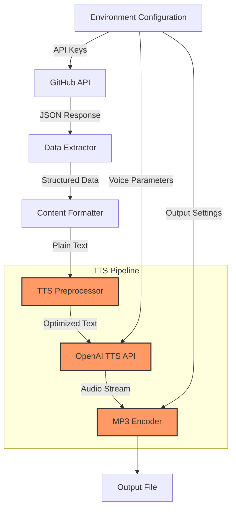

# Git Trends

A technical pipeline for transforming GitHub trending repository analyses into professional audio narrations via OpenAI's Text-to-Speech API.

## Technical Overview

Git Trends implements a data processing and text-to-speech (TTS) conversion system that synthesizes information about trending GitHub repositories into high-quality audio output. The system prioritizes voice modulation characteristics to deliver technical content with appropriate pacing, inflection, and tonal qualities.

## Architectural Components



## OpenAI TTS Integration Specifications

### API Implementation

The system uses OpenAI's streaming-based TTS implementation for enhanced performance and lower latency:

```python
with client.audio.speech.with_streaming_response.create(
    model = os.getenv("TTS_MODEL"),       # Model selection
    voice = os.getenv("TTS_VOICE"),       # Voice selection
    speed = float(os.getenv("TTS_SPEED")), # Speech rate modifier
    input = formatted_text,               # Repository analysis content
    instructions = os.getenv("TTS_INSTRUCTIONS"), # Voice styling directives
) as stream_response:
    stream_response.stream_to_file(output_path)
```

### Streaming Implementation Details

The TTS module implements the following streaming pattern:

1. Establishes connection to OpenAI audio endpoint
2. Transmits request parameters and text content
3. Receives chunked audio data via HTTP streaming response
4. Progressively writes chunks to output file
5. Handles backpressure automatically
6. Auto-closes resources upon completion

### Audio Processing Parameters

| Parameter | Type | Description | Typical Values |
|-----------|------|-------------|----------------|
| `model` | string | TTS model identifier | "gpt-4o-mini-tts" |
| `voice` | string | Base voice profile | "ash", "nova", "echo" |
| `speed` | float | Playback rate modifier | 1.0 (normal), 2.0-2.2 (fast) |
| `input` | string | Source text for narration | Repository analysis text |
| `instructions` | string | Voice customization directives | Structured voice parameters |

## Voice Parameter Engineering

The system employs a structured parameter format for precise control of voice characteristics:

```
Personality/affect: Technical authority with analytical precision
Voice: Medium-deep, clear articulation, precise diction
Tone: Matter-of-fact, technically engaged, micro-variations for emphasis
Dialect: Technical vernacular with standardized pronunciation of programming terms
Pronunciation: Careful enunciation of repository names, language identifiers, and technical terms
Features: Consistent pacing with micro-pauses between logical sections, subtle emphasis on key metrics
```

### Voice Optimization Strategies

The voice parameter optimization process involves:

1. Acoustic parameter tuning for technical terminology clarity
2. Repository name pronunciation normalization
3. Micro-pause insertion at logical boundaries
4. Emphasis allocation for technical metrics and key features
5. Speed recalibration based on information density

## Technical Implementation Notes

### Text Preprocessing

To optimize TTS performance, the system applies the following transformations:

1. Normalization of repository names and technical terms
2. Insertion of pronunciation guides for ambiguous terms
3. Addition of micro-pause markers (`,`) at logical boundaries
4. Sentence restructuring for optimal prosody
5. Acronym expansion where appropriate

### File Output Specifications

- Format: MP3 (MPEG Layer III)
- Duration: Typically 30sec-2min minutes depending on content volume
- Naming Convention: `git-trends-{period}-{ISO_DATE}.mp3`

## Configuration Reference

```
# API Authentication
GITHUB_TOKEN=github_pat_xxxxx
OPENAI_API_KEY=sk-xxxxx

# TTS Configuration
TTS_MODEL=gpt-4o-mini-tts
TTS_VOICE=ash
TTS_SPEED=2.2

# Voice Styling
TTS_INSTRUCTIONS="Personality/affect: Technical authority with analytical precision. Voice: Medium-deep, clear articulation, precise diction. Tone: Matter-of-fact, technically engaged, micro-variations for emphasis. Dialect: Technical vernacular with standardized pronunciation of programming terms. Pronunciation: Careful enunciation of repository names, language identifiers, and technical terms. Features: Consistent pacing with micro-pauses between logical sections, subtle emphasis on key metrics."
```

## License

MIT