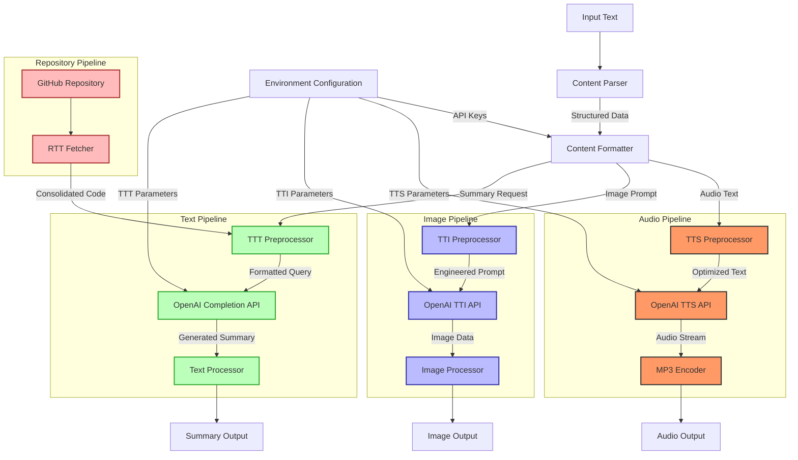

# TTX: Text-to-Anything

A technical implementation for converting textual content into multiple output modalities using OpenAI's APIs.

## Technical Overview

TTX (Text-to-Anything) implements a multi-modal content generation system that transforms input text into various outputs, including:

1. **Audio narrations** (Text-to-Speech)
2. **Visual assets** (Text-to-Image)
3. **Repository analysis** (GitHub-to-Text)
4. **Content summaries** (Text-to-Text)

The system leverages OpenAI's APIs with optimized parameter configurations for high-quality output across different media types.

## Core Components

### Text Processing Scripts

| Script | Function | Description |
|--------|----------|-------------|
| `ttt.py` | Text-to-Text | Analyzes text files and generates concise summaries using OpenAI's GPT-4.1 |
| `rtt.py` | Repo-to-Text | Fetches GitHub repository contents and consolidates files for analysis |
| `tts.py` | Text-to-Speech | Converts text into natural-sounding narration via OpenAI's TTS models |
| `tti.py` | Text-to-Image | Transforms text descriptions into visual representations using DALL-E 3 |

## Architectural Components



## OpenAI SDK Integration

### Text-to-Speech (TTS) Implementation

```python
with client.audio.speech.with_streaming_response.create(
    model = os.getenv("TTS_MODEL"),
    voice = os.getenv("TTS_VOICE"),
    speed = float(os.getenv("TTS_SPEED")),
    input = formatted_text,
    instructions = os.getenv("TTS_INSTRUCTIONS"),
) as stream_response:
    stream_response.stream_to_file(audio_output_path)
```

### Text-to-Image (TTI) Implementation

```python
response = client.images.generate(
    model = os.getenv("IMAGE_MODEL"),
    prompt = formatted_prompt,
    n = 1,
    size = os.getenv("IMAGE_SIZE"),
    quality = os.getenv("IMAGE_QUALITY"),
    response_format = os.getenv("IMAGE_FORMAT"),
    style = os.getenv("IMAGE_STYLE"),
)

# Process image data based on response format
image_data = response.data[0]
if hasattr(image_data, 'url') and image_data.url:
    # Download and save image from URL
    img_response = requests.get(image_data.url)
    with open(image_output_path, "wb") as img_file:
        img_file.write(img_response.content)
elif hasattr(image_data, 'b64_json') and image_data.b64_json:
    # Decode and save base64 data
    img_data = base64.b64decode(image_data.b64_json)
    with open(image_output_path, "wb") as img_file:
        img_file.write(img_data)
```

### Text-to-Text (TTT) Implementation

```python
def generate_summary(text):
    """Generate a summary of the text using OpenAI API."""
    client = OpenAI(api_key=os.environ.get("OPENAI_API_KEY"))
    
    response = client.chat.completions.create(
        model="gpt-4.1",
        messages=[
            {
                "role": "developer",
                "content": "You are a helpful assistant that summarizes technical documents. Your summary should capture the key points, concepts, and instructions in the document. Be concise but comprehensive."
            },
            {
                "role": "user",
                "content": f"Summarize the following text:\n\n{text}"
            }
        ]
    )
    
    return response.choices[0].message.content
```

### Repository-to-Text (RTT) Implementation

```python
def fetch_github_repo(owner, repo, max_files=20, max_size=10000, token=None):
    """Fetch GitHub repository files and consolidate for analysis"""
    # API setup
    base_url = f"https://api.github.com/repos/{owner}/{repo}/contents"
    headers = {}
    if token:
        headers["Authorization"] = f"token {token}"
    
    # Recursive content retrieval (summarized)
    # [implementation details omitted for brevity]
    
    # Format consolidated output with file separators
    consolidated_text = f"""# GitHub Repository: {owner}/{repo}
# Retrieved: {datetime.datetime.now().strftime("%Y-%m-%d %H:%M:%S")}
# Files Analyzed: {len(repo_contents)}"""
    
    for file_path, content in repo_contents.items():
        consolidated_text += f"""
{'=' * 80}
FILE: {file_path}
{'=' * 80}

{content}

"""
    
    return consolidated_text, len(repo_contents)
```

## API Parameters

### TTS Parameters (Audio Generation)

| Parameter | Type | Description | Typical Values |
|-----------|------|-------------|----------------|
| `model` | string | TTS model identifier | "gpt-4o-mini-tts" |
| `voice` | string | Base voice profile | "ash", "nova", "echo" |
| `speed` | float | Playback rate modifier | 1.0 (normal), 2.0-2.2 (fast) |
| `input` | string | Source text for narration | Formatted input text |
| `instructions` | string | Voice customization directives | Structured voice parameters |

### TTI Parameters (Image Generation)

| Parameter | Type | Description | Typical Values |
|-----------|------|-------------|----------------|
| `model` | string | Image model identifier | "dall-e-3" |
| `prompt` | string | Image generation prompt | Formatted visual prompt |
| `n` | integer | Number of images to generate | 1 (for dall-e-3) |
| `size` | string | Image dimensions | "1024x1024", "1792x1024", "1024x1792" |
| `quality` | string | Image fidelity setting | "standard", "hd" |
| `response_format` | string | Return data format | "url", "b64_json" |
| `style` | string | Aesthetic style | "vivid", "natural" |

### TTT Parameters (Text Summarization)

| Parameter | Type | Description | Typical Values |
|-----------|------|-------------|----------------|
| `model` | string | Language model identifier | "gpt-4.1" |
| `messages` | array | Conversation context | Role-based message objects |
| `role` | string | Message attribution | "developer", "user", "assistant" |
| `content` | string | Message content | Instruction text, source text |

### RTT Parameters (Repository Fetching)

| Parameter | Type | Description | Typical Values |
|-----------|------|-------------|----------------|
| `owner` | string | GitHub username/organization | "username" |
| `repo` | string | Repository name | "repository-name" |
| `max_files` | integer | File retrieval limit | 20 |
| `max_size` | integer | Maximum file size in bytes | 10000 |
| `token` | string | GitHub Personal Access Token | Environment variable |

## Protocol Implementation Notes

### TTS Pipeline Technical Details

- Uses streaming response pattern for efficient memory usage
- Implements chunked data handling for progressive file generation
- MP3 output with 24kHz sampling rate and variable bitrate (~48 kbps)
- Supports customized voice parameters for specialized content delivery

### TTI Pipeline Technical Details

- Non-streaming synchronous request/response pattern
- Two-stage processing for URL responses (fetch and save)
- Single-stage for base64 responses (decode and save)
- PNG output with dimensions based on vertical/horizontal content needs
- Vertical formats (1024x1792) optimized for social media platforms

### TTT Pipeline Technical Details

- Synchronous completion request pattern
- Developer role messaging for consistent instruction following
- Optimized for technical content summarization
- Direct console output with formatting for readability

### RTT Pipeline Technical Details

- Recursive directory traversal for repository exploration
- Content filtering to exclude binary and large files
- Structured text output with clear file demarcation
- Token-based authentication for private repositories
- Size and count limits for efficient processing

## Parameter Engineering

### Voice Parameter Format

```
Personality/affect: Technical authority with analytical precision
Voice: Medium-deep, clear articulation, precise diction
Tone: Matter-of-fact, technically engaged, micro-variations for emphasis
Dialect: Technical vernacular with standardized pronunciation
Pronunciation: Careful enunciation of technical terms
Features: Consistent pacing with micro-pauses between sections
```

### Image Prompt Engineering

Image prompts follow a structured format with:
- Subject specification with clear visual attributes
- Composition instructions for aspect ratio optimization
- Style directives for visual consistency
- Background and foreground element specification
- Format-specific optimizations (vertical/horizontal)

### Text Summarization Engineering

Summary prompts utilize a structured role-based approach:
- Developer role for setting summarization parameters
- Clear instruction specification for content emphasis
- Document type identification for context-appropriate summarization
- Technical vocabulary preservation for domain-specific summaries

## Configuration Reference

```
# TTS Configuration
TTS_MODEL=gpt-4o-mini-tts
TTS_VOICE=ash
TTS_SPEED=2.2
TTS_INSTRUCTIONS="Personality/affect: Technical authority with analytical precision. Voice: Medium-deep, clear articulation, precise diction. Tone: Matter-of-fact, technically engaged, micro-variations for emphasis. Dialect: Technical vernacular with standardized pronunciation. Pronunciation: Careful enunciation of technical terms. Features: Consistent pacing with micro-pauses between logical sections."

# TTI Configuration
IMAGE_MODEL=dall-e-3
IMAGE_SIZE=1024x1792
IMAGE_QUALITY=standard
IMAGE_FORMAT=url
IMAGE_STYLE=vivid

# API Configuration
OPENAI_API_KEY=your_openai_api_key
GITHUB_TOKEN=your_github_personal_access_token
```

## License

MIT